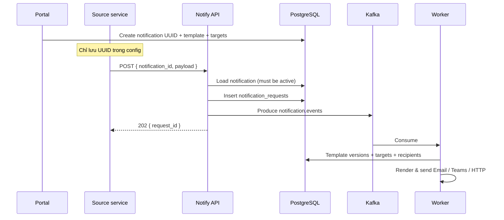

# Design — Notification Platform

## 1. Principle

**Portal sở hữu cấu hình. Service chỉ biết UUID.**

| Trên portal | Service truyền |
|-------------|----------------|
| Template (email / Teams / webhook body) | `notification_id` (UUID) |
| Channels + endpoints | `payload` (biến động, optional) |
| Recipient groups | `idempotency_key` / `correlation_id` (optional) |
| Severity, ACL source | |

Đổi Teams webhook, thêm email, sửa template → chỉ sửa portal, **không** redeploy Airflow/ETL/Core.

## 2. Flow



## 3. Domain

```
notifications (UUID) ── template
       │
       ├── notification_targets → channels / endpoints / recipient_groups
       │                      → service_integrations (webhook)
       └── notification_allowed_sources → source_systems

source_systems ── api_clients

notification_requests(notification_id, payload)
       └── notification_deliveries ── delivery_attempts
```

Không còn `routing_rules` phía caller — **notification = đơn vị cấu hình**.

## 4. Extensibility

| Thêm… | Portal làm gì | Service làm gì |
|-------|---------------|----------------|
| Noti mới | Tạo notification → copy UUID | Gắn UUID vào config |
| Channel mới cho noti có sẵn | Thêm `notification_targets` | Không đổi |
| Source mới | Đăng ký source + API key + ACL | Gọi cùng UUID (nếu được allow) |
| Gọi service khác | Target channel `webhook` + integration | Không đổi |

## 5. UI surfaces

| Screen | Job |
|--------|-----|
| **Notifications** | CRUD đơn vị UUID; gắn template, channels, groups, ACL; copy UUID |
| Templates | Bodies per channel + variables schema |
| Channels | Email / Teams / HTTP endpoints |
| Recipients | Groups |
| Sources | API keys |
| Integrations | Other services |
| Logs | By notification_id |
| Playground | Test bằng UUID + payload |

## 6. Security

- API key per source; optional ACL trên từng notification UUID
- Secrets chỉ qua Vault `secret_ref`
- Payload validate theo `variables_schema` của template/notification

## 7. Non-goals (v1)

- Caller chọn channel/recipient lúc runtime
- Event-type routing từ phía service
