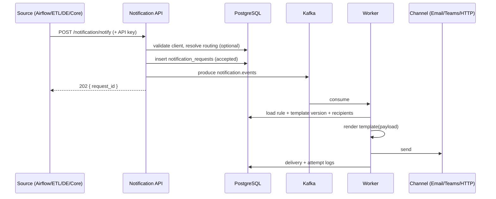

# Design — Notification Platform

## 1. Problem

Nhiều hệ thống (Airflow, ETL, DE service, Core, …) cần gửi thông báo qua
**MS Teams** và **Email**, đồng thời có thể **gọi tiếp service notify khác**
(Pager bridge, Slack gateway, OMS, …). Cần:

- Một endpoint chuẩn: `POST /notification/notify`
- Pub/sub qua Kafka (không block caller)
- Template quản lý trên UI
- Schema Postgres mở rộng cho nhiều source / channel / service

## 2. Flow chính



### Caller contract (minimal)

Caller chỉ cần biết:

| Field | Required | Note |
|-------|----------|------|
| `event_type` | yes | `dag.failed`, `pipeline.success`, … |
| `payload` | yes | biến cho template |
| `severity` | no | default `info` |
| `idempotency_key` | no | dedupe |
| `correlation_id` | no | `dag_run_id` / `trace_id` |
| `template_code` | no | bypass routing nếu biết sẵn |
| `channels` | no | override channel list |
| `recipients` | no | override / bổ sung recipients |

Routing mặc định: `(source_system, event_type, severity, match_expr)` → template + channels + recipient groups.

## 3. Domain model

```
source_systems ──┬── api_clients
                 └── routing_rules ──┬── templates ── template_versions
                                     └── routing_rule_channels
                                              ├── channels ── channel_endpoints
                                              └── recipient_groups ── recipients

notification_requests ── notification_deliveries ── delivery_attempts

service_integrations ── channel_endpoints (webhook type)
```

### Extensibility

| Muốn thêm… | Làm gì |
|------------|--------|
| Source mới (Flink, Spark) | Insert `source_systems` + API key |
| Channel mới (Slack, SMS) | Insert `channels` + adapter trong worker |
| Endpoint SMTP / Teams mới | Insert `channel_endpoints` |
| Gọi service khác | Channel type `webhook` + `service_integrations` |
| Template mới | UI tạo template + version per channel |
| Rule mới | UI tạo routing rule |

Không cần migrate schema khi thêm source/channel type mới (chỉ thêm CHECK value nếu muốn cứng).

## 4. Kafka

| Topic | Key | Value |
|-------|-----|-------|
| `notification.events` | `source_system` \| `event_type` | NotifyEvent (JSON) |
| `notification.events.dlq` | same | failed after max retries |
| `notification.retry` | delivery_id | optional delayed retry topic |

Message envelope: xem `docs/API.md`.

Partition theo `source_system` để giữ thứ tự tương đối per source.

## 5. Worker responsibilities

1. Consume `notification.events`
2. Resolve routing (nếu API chưa gắn rule) hoặc dùng rule đã gắn
3. Load active `template_versions` theo `channel_type`
4. Render (Mustache / Jinja2) — escape theo channel
5. Expand recipient groups
6. Create `notification_deliveries` rows
7. Call channel adapter:
   - **email** → SMTP / SES
   - **msteams** → Incoming Webhook / Adaptive Card
   - **webhook** → HTTP POST tới service khác (mapping từ `service_integrations`)
8. Retry với backoff; sau `max_attempts` → `dead` + DLQ

## 6. UI surfaces

| Screen | Job |
|--------|-----|
| Overview | Success rate, volume by source/channel |
| Sources | Register systems + API keys |
| Channels | Email / Teams / Webhook endpoints |
| Templates | Editor + preview + version history |
| Routing | Map event → template + channels + groups |
| Recipients | People / groups |
| Integrations | Other services (webhook adapters) |
| Logs | Request & delivery search |
| Playground | Send test notify |

Chi tiết wireframe: `docs/UI.md`.

## 7. Security

- API key per source client (hash lưu DB, prefix để identify)
- Secrets (SMTP password, Teams webhook URL) chỉ qua Vault `secret_ref`
- Scope tối thiểu: `notify` | `admin`
- Idempotency key tránh spam duplicate
- Rate limit per `api_client`

## 8. Non-goals (v1)

- In-app user inbox / push mobile
- Full marketing email campaign builder
- Real-time chat bot conversation
