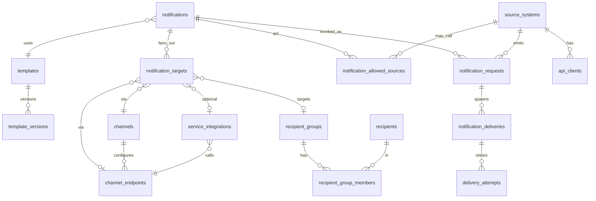

# ER diagram — UUID-first model

```mermaid
erDiagram
  notifications ||--o{ notification_targets : fans_out
  notifications }o--|| templates : uses
  notifications ||--o{ notification_allowed_sources : acl
  notifications ||--o{ notification_requests : invoked_as

  templates ||--o{ template_versions : versions

  notification_targets }o--|| channels : via
  notification_targets }o--o| channel_endpoints : via
  notification_targets }o--o| recipient_groups : targets
  notification_targets }o--o| service_integrations : optional

  source_systems ||--o{ api_clients : has
  source_systems ||--o{ notification_allowed_sources : may_call
  source_systems ||--o{ notification_requests : emits

  recipient_groups ||--o{ recipient_group_members : has
  recipients ||--o{ recipient_group_members : in

  channels ||--o{ channel_endpoints : configures
  service_integrations }o--|| channel_endpoints : calls

  notification_requests ||--o{ notification_deliveries : spawns
  notification_deliveries ||--o{ delivery_attempts : retries
```

**Caller key:** `notifications.id` (UUID).
