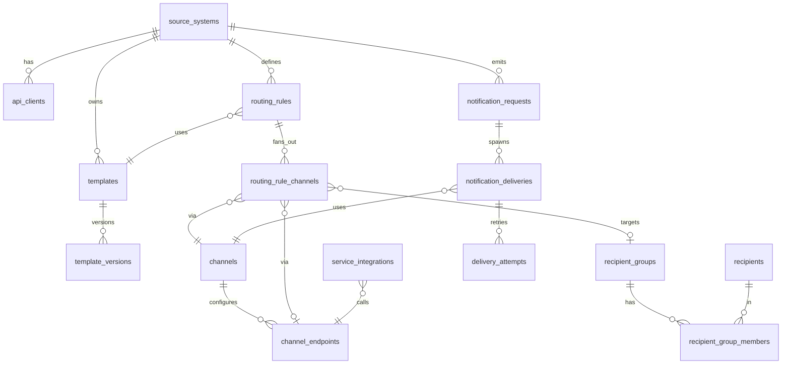

# ER diagram (schema overview)

```mermaid
erDiagram
  source_systems ||--o{ api_clients : has
  source_systems ||--o{ routing_rules : defines
  source_systems ||--o{ templates : owns
  source_systems ||--o{ notification_requests : emits

  templates ||--o{ template_versions : versions
  routing_rules ||--o{ routing_rule_channels : fans_out
  routing_rules }o--|| templates : uses

  channels ||--o{ channel_endpoints : configures
  routing_rule_channels }o--|| channels : via
  routing_rule_channels }o--o| channel_endpoints : via
  routing_rule_channels }o--o| recipient_groups : targets

  recipient_groups ||--o{ recipient_group_members : has
  recipients ||--o{ recipient_group_members : in

  notification_requests ||--o{ notification_deliveries : spawns
  notification_deliveries ||--o{ delivery_attempts : retries
  notification_deliveries }o--|| channels : uses

  service_integrations }o--|| channel_endpoints : calls
```

Seed applies baseline sources (`airflow`, `etl`, `de`, `core`), channels (`email`, `msteams`, `webhook`), and one Airflow failure template + rule.
